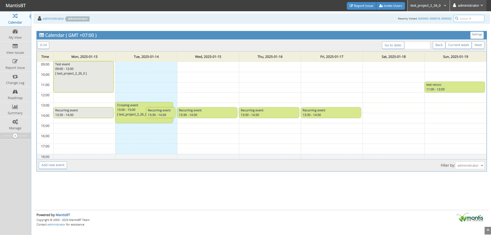
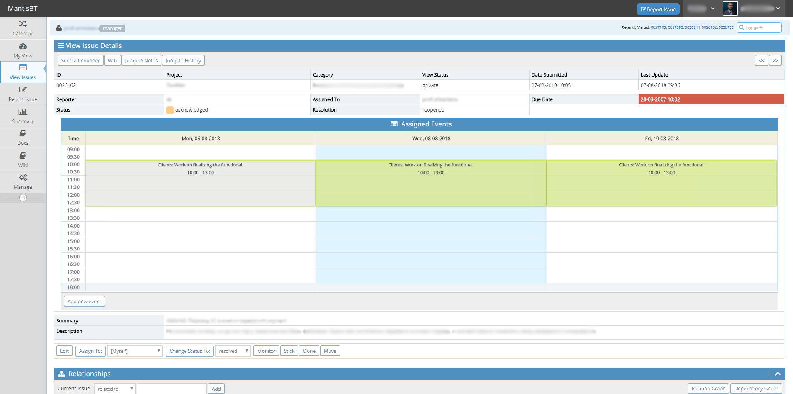
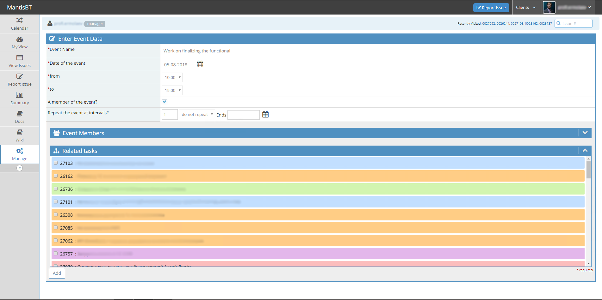
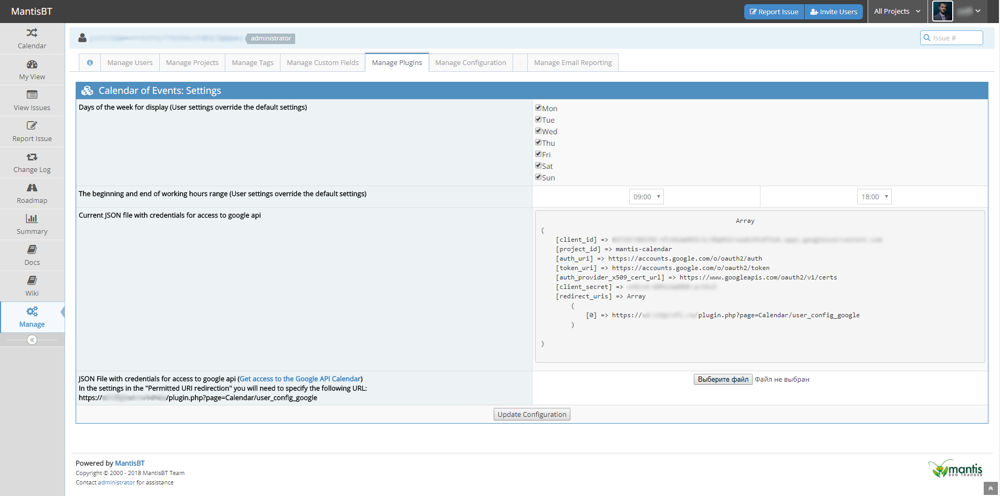
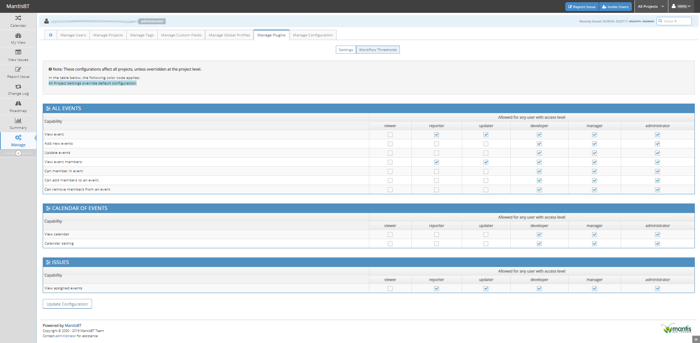

# MantisBT Calendar Plugin

Overview
--------
Adds the task scheduling function in MantisBT based on the calendar of events with the possibility of one-way synchronization with Google Calendar.

Screenshots
-----------

Features
--------
- The ability to create event.
- Binding any number of bugs to event.
- Bug can be related to any number of events.
- Visual display of events in bugs view page.
- One-way synchronization with Google Calendar (v. >= 2.3.0)
- Support for different time zones.
- Recurring events(v. >= 2.4.0-dev).

Download
--------
Please download the stable version.
(https://github.com/mantisbt-plugins/Calendar/releases/latest)

How to install
--------------

1. Copy Calendar folder into plugins folder.
2. Open Mantis with browser.
3. Log in as administrator.
4. Go to Manage -> Manage Plugins.
5. Find Calendar in the list.
6. Click Install.

How to enabled Google Calendar Sync (for Calendar version >= 2.3.0 )
----------------------------------------------------------------

1. Go to [Google Developers Console](https://console.developers.google.com/) and create the new project.
2. Download JSON file.
3. Upload the JSON file on the Calendar settings page.
4. Click the save button.
5. Go to the calendar settings for a specific user and click "Enable sync with Google Calendar"
6. Give permission to manage your calendars Google.
7. Select a calendar for one-way synchronization with Google Calendar.

Detailed instructions are provided in the project wiki.
https://github.com/mantisbt-plugins/Calendar/wiki#how-to-enabled-google-calendar-sync

Supported Versions
------------------

- MantisBT 2.14 and higher - supported
