# MantisBT Calendar Plugin

Overview
--------
Adds the task scheduling function in MantisBT based on the calendar of events with the possibility of one-way synchronization with Google Calendar.

Screenshots
-----------

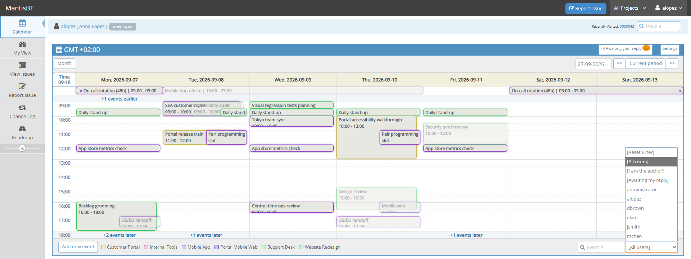

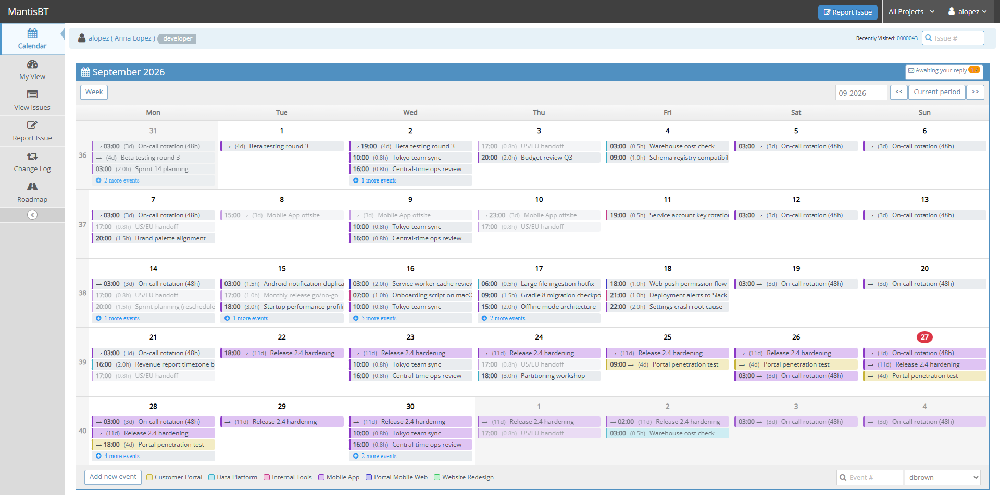

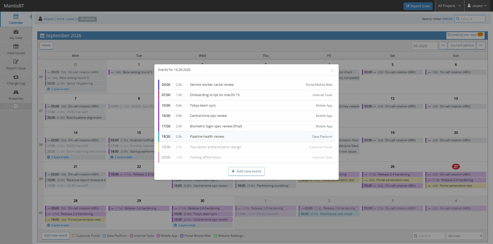

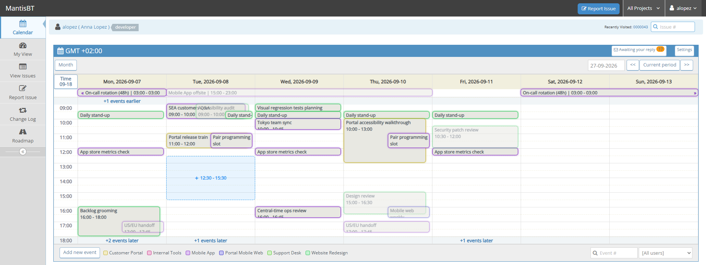

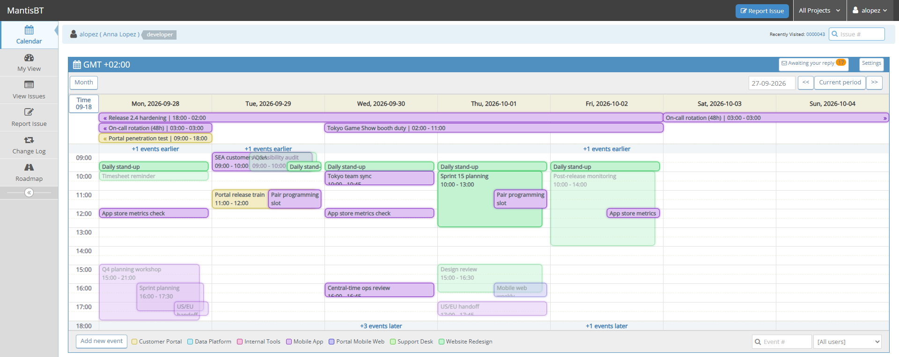

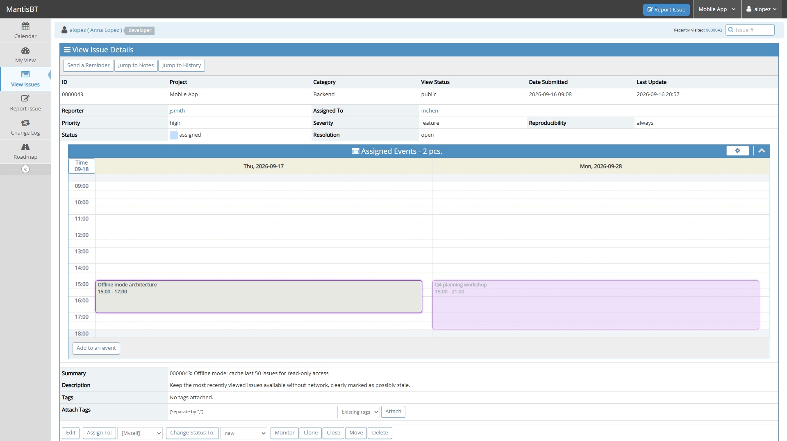
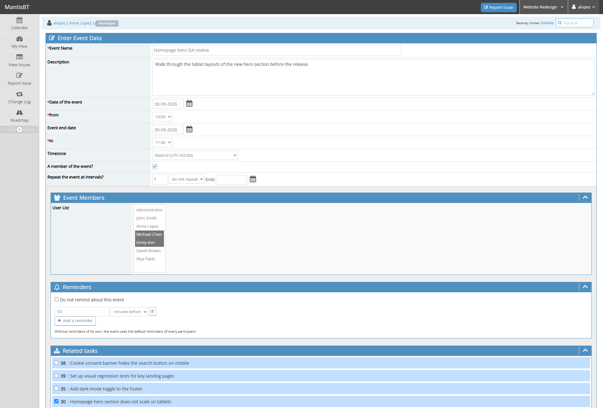

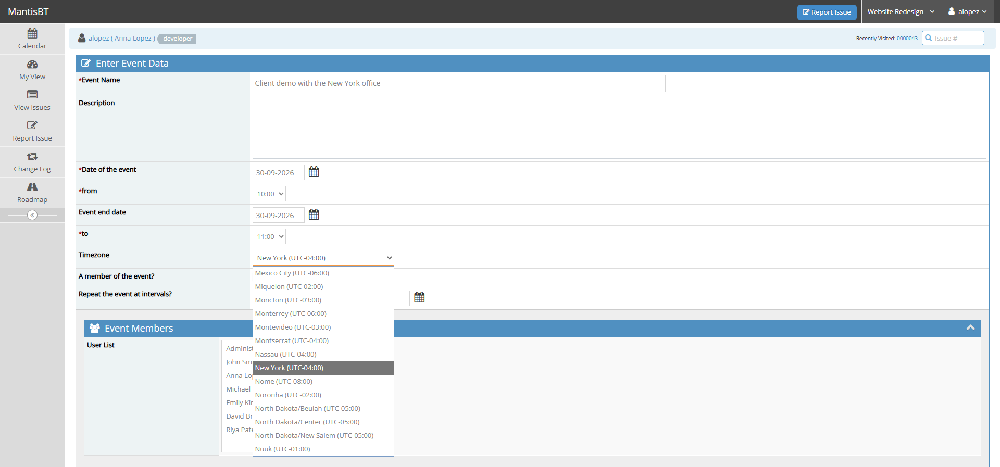

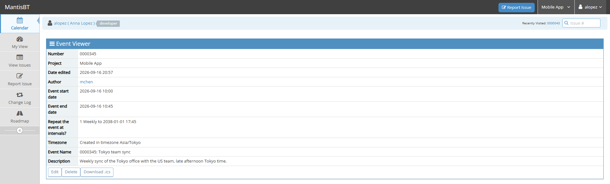

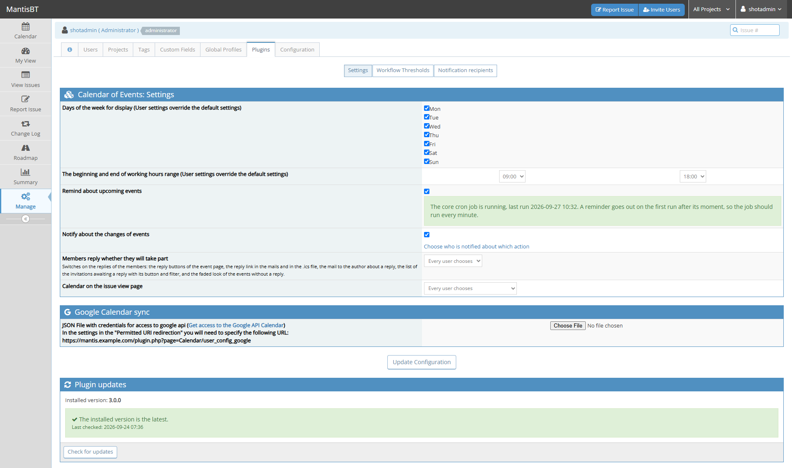
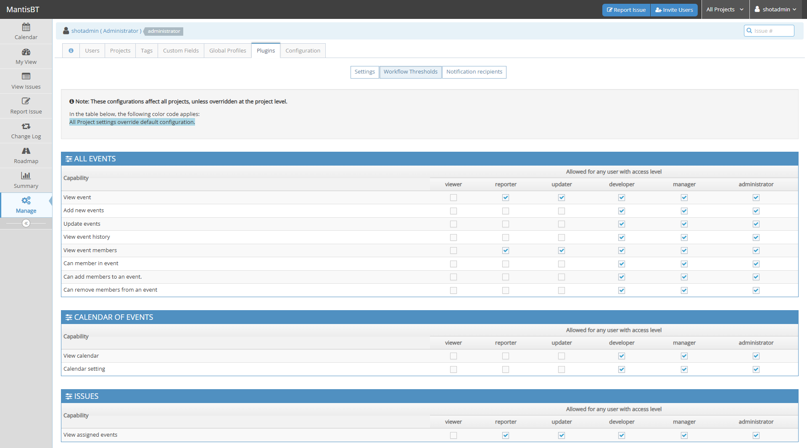

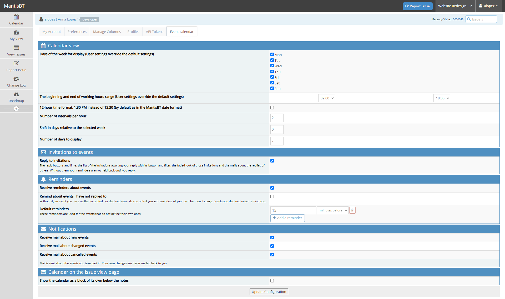

<!-- SCREENSHOT PLACEHOLDER (3.0.0): notification recipient matrix.
     Manage -> Manage Plugins -> Calendar -> notification settings page with
     the per-project matrix.
     Save as doc/notify_config_page.png and uncomment the line below.
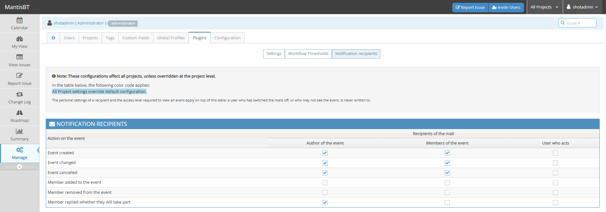
-->

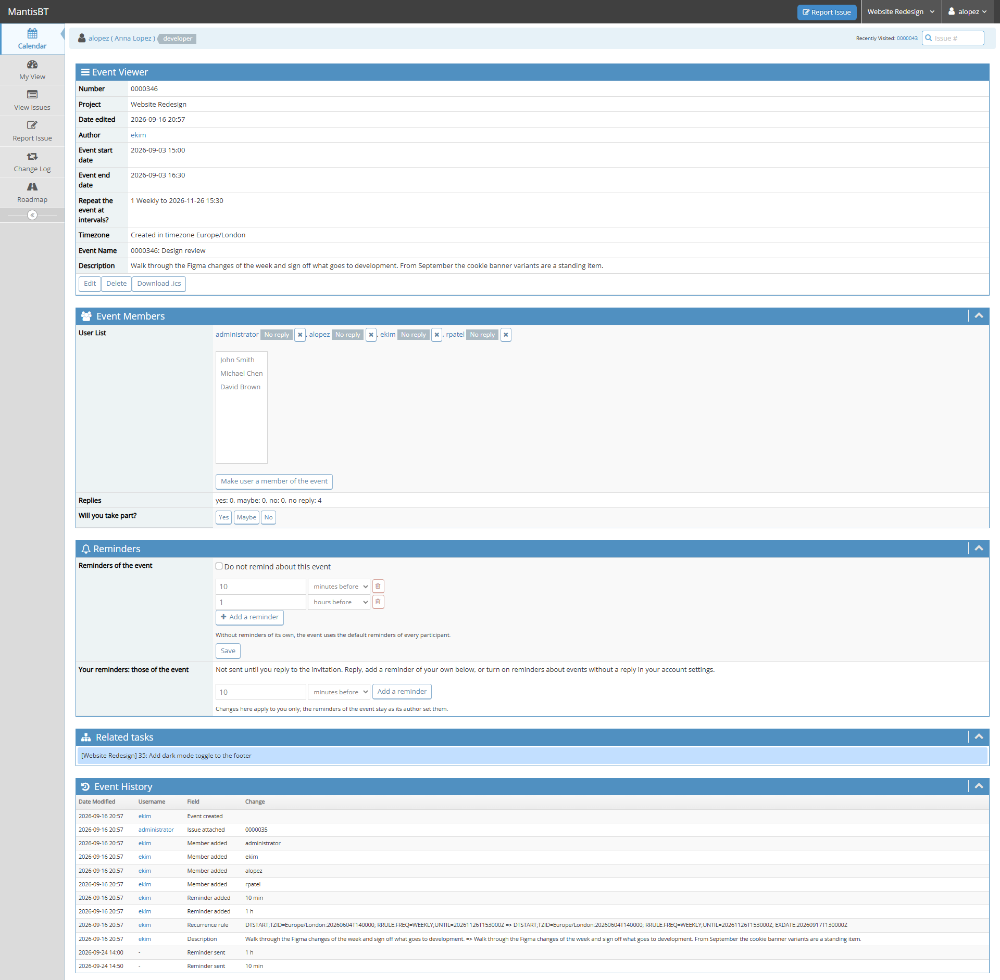

Features
--------
- The ability to create event.
- Binding any number of bugs to event.
- Bug can be related to any number of events.
- Visual display of events in bugs view page.
- One-way synchronization with Google Calendar (v. >= 2.3.0)
- Support for different time zones.
- Recurring events (v. >= 2.4.0).
- Month view (v. >= 3.0.0).
- Creating an event by selecting a time range in the week view — drag with the mouse or use two taps on a touch screen (v. >= 3.0.0).
- Per-event time zone: an event remembers the time zone it was scheduled in, and recurring events keep their local time across DST transitions; the time zone selector shows the UTC offset of every zone (v. >= 3.0.0).
- Events that span several days, shown as bands above the week grid (v. >= 3.0.0).
- Events are coloured by project, and a project legend below the calendar switches the current project with one click (v. >= 3.0.0).
- Event description (v. >= 3.0.0).
- E-mail reminders about upcoming events: per-event reminders or personal defaults, with a per-user opt-out (v. >= 3.0.0).
- E-mail notifications about created, changed and deleted events and about membership changes, with a per-project recipient matrix like the one of MantisBT itself (v. >= 3.0.0).
- Replies to invitations: members answer whether they will take part on the event page or from a link in the mail, and a list in the calendar header shows the invitations awaiting a reply (v. >= 3.0.0).
- Personal reminders: the author and every member can add or remove reminders of an event for themselves only (v. >= 3.0.0).
- Export of an event as an iCalendar (.ics) file, from the event page and from the notification mails (v. >= 3.0.0).
- Opening an event by its number from the calendar toolbar (v. >= 3.0.0).
- 12-hour (AM/PM) or 24-hour times, following the MantisBT date format by default, with a per-user choice in the account settings (v. >= 3.0.0).
- Choice of where the calendar sits on the issue page: a row of the issue details, a block of its own, or per user (v. >= 3.0.0).
- Manual check for a newer release on the settings page (v. >= 3.0.0).
- Event history, with records written by other plugins shown next to the native ones (v. >= 3.0.0).
- Public API for other plugins: create events from your own plugin, write to the history of an event, ask who would be notified, record replies, manage the reminders of a user, get the .ics file of an event and subscribe to calendar changes (v. >= 3.0.0).
- Telegram integration: creating and managing calendar events from Telegram and receiving Telegram notifications about created and changed events — with the [TelegramBot](https://github.com/mantisbt-plugins/TelegramBot) plugin 2.0 and newer (v. >= 3.0.0).

Supported Versions
------------------
- MantisBT 2.14 to 2.25.x - supported in release up to 2.6.x (fixes only)
- MantisBT 2.26.0 and higher - supported in release 2.7.0 and higher
- PHP 7.4 and higher

Download
--------
Please download the stable version.
(https://github.com/mantisbt-plugins/Calendar/releases/latest)

Documentation
-------------
The instructions live in the [project wiki](https://github.com/mantisbt-plugins/Calendar/wiki); the same pages are kept in the [doc](doc/) folder of the repository, versioned with the code:

- [Installation](https://github.com/mantisbt-plugins/Calendar/wiki/Installation) — requirements, installing and upgrading the plugin.
- [Google Calendar Sync](https://github.com/mantisbt-plugins/Calendar/wiki/Google-Calendar-Sync) — enabling the one-way synchronization, step by step.
- [Reminders and Notifications](https://github.com/mantisbt-plugins/Calendar/wiki/Reminders-and-Notifications) — e-mail reminders, notifications about changes, replies to invitations and the .ics file (v. >= 3.0.0).
- [Public API for other plugins](https://github.com/mantisbt-plugins/Calendar/wiki/Public-API-for-other-plugins) — creating events, writing event history, replies, reminders, the .ics file and calendar signals from your own plugin (v. >= 3.0.0).

The upgrade notes of each version are part of its [release](https://github.com/mantisbt-plugins/Calendar/releases).

Donate
--------------
All work on this plugin consists of many hours of coding during our free time, to provide you with a Calendar 
that is easy to use. If you enjoy using this plugin and would like to say thank you, donations are a great 
way to show your support.

Donations are invested back into the project 👍

Thank you for keeping this project alive 🙏

Available methods:
1. TGFFBC28Wo27aQ24L4ku6y3Egbe12Jhv1k (USDT TRC20)
2. 1PxyVPeYhRUtt5Mg1t3xSmFtHSYf2CabLR (BTC)
